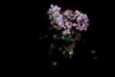
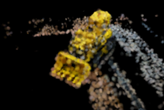

# Gaussian Fusion

> A novel approach for text-guided 3D shape generation that enhances the Latent-NeRF framework by replacing the NeRF architecture with Gaussian Splatting.

## Overview
> This project improves text-to-3D generation by introducing two key modifications to the Latent-NeRF framework by replacing the NeRF architecture with Gaussian Splatting, which has shown promise in novel view synthesis
> Our experiments demonstrate significant improvements across multiple metrics:

-More detailed object generation
-Higher PSNR and SSIM scores
-Clearer and sharper scenes with better multi-view consistency
-Reduced visual artifacts
-More comprehensive viewing angles

## Results
<div class="results-container">
  <h2>Results: Latent Gaussian Splatting</h2>
  <p class="description">Visualization of 3D objects generated using our Latent Gaussian Splatting approach.</p>
  
  <div class="results-grid">
    <div class="result-item">
        
        <p>3D burger</p>
    </div>
    <div class="result-item">
        
        <p>F3D bonsai</p>
    </div>
    <div class="result-item">
        
        <p>Bonsai with detailed branch and leaf representation</p>
    </div>
    <div class="result-item">
        
        <p>Tractor with accurate geometric features</p>
    </div>
</div>


## Acknowledgments
Our work builds upon the following research:

- [Latent-NeRF for Shape-Guided Generation of 3D Shapes and Textures](https://arxiv.org/abs/2211.07600) (Metzer et al., 2022)
- [3D Gaussian Splatting for Real-Time Radiance Field Rendering]([https://repo-sam.inria.fr/fungraph/3d-gaussian-splatting/3d_gaussian_splatting_high.pdf]) (Kerbl et al., 2023)


```bibtex
@article{metzer2022latent,
  title={Latent-NeRF for Shape-Guided Generation of 3D Shapes and Textures},
  author={Metzer, Gal and Richardson, Elad and Patashnik, Or and Giryes, Raja and Cohen-Or, Daniel},
  journal={arXiv preprint arXiv:2211.07600},
  year={2022}
}
```

```bibtex
@Article{kerbl3Dgaussians,
      author       = {Kerbl, Bernhard and Kopanas, Georgios and Leimk{\"u}hler, Thomas and Drettakis, George},
      title        = {3D Gaussian Splatting for Real-Time Radiance Field Rendering},
      journal      = {ACM Transactions on Graphics},
      number       = {4},
      volume       = {42},
      month        = {July},
      year         = {2023},
      url          = {https://repo-sam.inria.fr/fungraph/3d-gaussian-splatting/}
}
```


