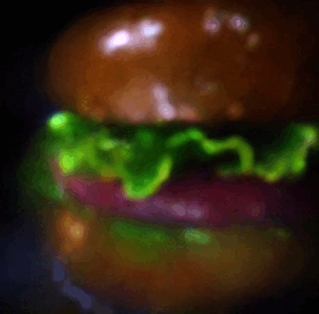
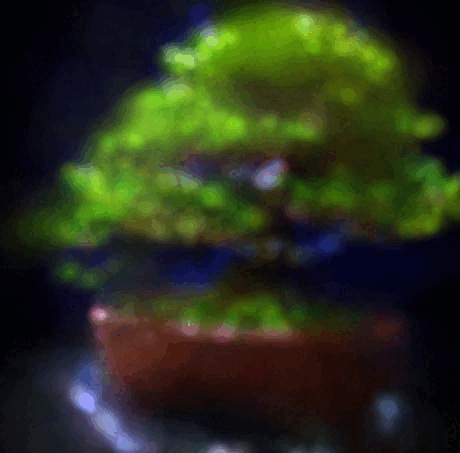
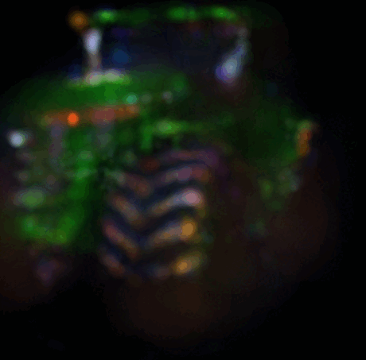
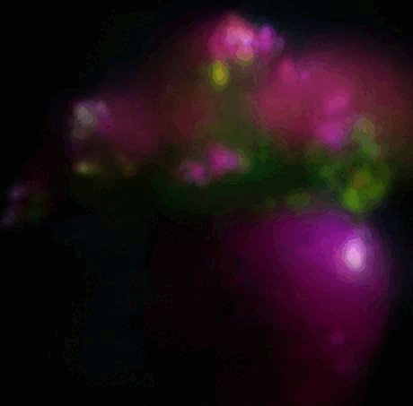

# Gaussian Fusion

> A novel approach for text-guided 3D shape generation that enhances the Latent-NeRF framework by replacing the NeRF architecture with Gaussian Splatting.

## Overview
> This project improves text-to-3D generation by introducing two key modifications to the Latent-NeRF framework by replacing the NeRF architecture with Gaussian Splatting, which has shown promise in novel view synthesis
> Our experiments demonstrate significant improvements across multiple metrics:

-More detailed object generation
-Higher PSNR and SSIM scores
-Clearer and sharper scenes with better multi-view consistency
-Reduced visual artifacts
-More comprehensive viewing angles

## Results
<div class="results-container">
  <h2>Results: Latent Gaussian Splatting</h2>
  <p class="description">Visualization of 3D objects generated using our Latent Gaussian Splatting approach.</p>
  
  <div class="results-grid">
    <div class="result-item">
        
        <p>Realistic burger with complex shapes</p>
    </div>
    <div class="result-item">
        
        <p>Bonsai with detailed branch and leaf representation</p>
    </div>
    <div class="result-item">
        
        <p>Tractor</p>
    </div>
    <div class="result-item">
        
        <p>Vase with flowers</p>
    </div>
</div>

## Setup
1. Install conda.
2. pip install the following environments:
    - opencv-python
    - joblib
    - transformers
    - diffusers
    - accelerate
    - huggingface-hub
    - ninja
    - xatlas
    - imageio
    - matplotlib
    - pyrallis
    - loguru
    - tqdm
    - pytorch=2.5.1
    - plyfile
  3. Install cudatools. We have use version 12.4 which was compatible with pytorch 2.5.1
  4. Note that you need a token for stable diffusion First accept conditions for the model you want to use, default one is CompVis/stable-diffusion-v1-4. Then, add a TOKEN file access token to the root folder of this project, or use the huggingface-cli login command. More explamaition in Latent Nerf repository. After downloading the tokens, add them to the main folder of the project.
  5. For changing the text prompt, go to demo_configs/latent_nerf/lego_tractor.yaml.
  6. Activate the code in the terminal using: python -m scripts.train_latent_nerf --config_path demo_configs/latent_nerf/lego_tractor.yaml
  7. For seeing the results, go to the experiment directory and explore the training results, evaluation results and final results.
  8. For the full documentary of the project, read the attached article.

## Acknowledgments
Our work builds upon the following research:

- [Latent-NeRF for Shape-Guided Generation of 3D Shapes and Textures](https://arxiv.org/abs/2211.07600) (Metzer et al., 2022)
- [3D Gaussian Splatting for Real-Time Radiance Field Rendering]([https://repo-sam.inria.fr/fungraph/3d-gaussian-splatting/3d_gaussian_splatting_high.pdf]) (Kerbl et al., 2023)


```bibtex
@article{metzer2022latent,
  title={Latent-NeRF for Shape-Guided Generation of 3D Shapes and Textures},
  author={Metzer, Gal and Richardson, Elad and Patashnik, Or and Giryes, Raja and Cohen-Or, Daniel},
  journal={arXiv preprint arXiv:2211.07600},
  year={2022}
}
```

```bibtex
@Article{kerbl3Dgaussians,
      author       = {Kerbl, Bernhard and Kopanas, Georgios and Leimk{\"u}hler, Thomas and Drettakis, George},
      title        = {3D Gaussian Splatting for Real-Time Radiance Field Rendering},
      journal      = {ACM Transactions on Graphics},
      number       = {4},
      volume       = {42},
      month        = {July},
      year         = {2023},
      url          = {https://repo-sam.inria.fr/fungraph/3d-gaussian-splatting/}
}
```


